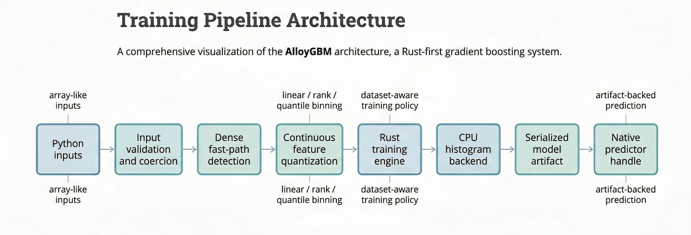
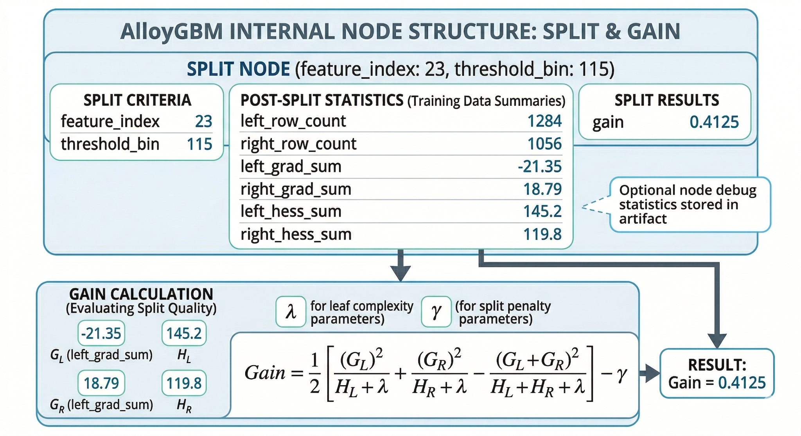

Architecture
============

This page gives a technical overview of how AlloyGBM is organized internally.

High-level component layout
---------------------------

The repository is split into Rust workspace crates plus Python bindings:

- ``crates/core``
  - shared data contracts, matrices, gradients, artifacts, NaN handling
- ``crates/engine``
  - training logic, objective implementations, policy-driven iteration control
- ``crates/backend_cpu``
  - CPU histogram building, split evaluation, NaN-aware partitioning
- ``crates/predictor``
  - artifact-backed prediction with post-transform support (sigmoid for
    classification)
- ``crates/shap``
  - TreeSHAP explanation support (polynomial-time exact Shapley values)
- ``crates/categorical``
  - categorical support helpers (target encoding, frequency encoding)
- ``bindings/python``
  - Python extension module and public package (GBMRegressor, GBMClassifier,
    GBMRanker)

Objective implementations
-------------------------

The engine implements a generic ``ObjectiveOps`` trait with these concrete
objectives:

- ``SquaredErrorObjective`` -- MSE loss for regression
- ``BinaryCrossEntropyObjective`` -- log-loss for binary classification
- ``RankPairwiseObjective`` -- RankNet pairwise logistic
- ``RankNdcgObjective`` -- LambdaMART with NDCG weighting
- ``RankXendcgObjective`` -- cross-entropy approximation to NDCG
- ``QueryRmseObjective`` -- query-grouped RMSE
- ``YetiRankObjective`` -- stochastic NDCG-weighted pairwise

Training pipeline
-----------------

At a high level, Python training flows like this:

1. Python input validation and coercion
2. dense fast-path detection for array-like inputs
3. continuous-feature quantization when needed (up to 65,535 bins)
4. NaN handling -- missing values are routed to a dedicated bin
5. Rust engine training with the selected objective
6. artifact serialization (includes objective metadata for post-transforms)
7. native predictor handle creation for later inference

   High-level AlloyGBM training pipeline from Python inputs to serialized model
   artifact and native predictor handle.

Tree growth strategies
----------------------

AlloyGBM supports two tree growth strategies:

- **Level-wise** (default): grows trees level-by-level, expanding all nodes at
  the current depth before moving deeper
- **Leaf-wise**: grows trees by selecting the leaf with the highest split gain
  at each step, similar to LightGBM's strategy

Artifact design
---------------

AlloyGBM keeps a binary artifact format with magic bytes ``AGBM`` and versioned
sections:

- Trees section
- PredictorLayout section (includes objective type for post-transforms)
- CategoricalState section
- JSON metadata header

Artifact-backed inference is part of the public Python story, and the format
supports model persistence via pickle, ``save_model``/``load_model``, and raw
byte export.

Recent design choices
---------------------

The current codebase includes several design decisions:

- dense native ingestion paths to avoid unnecessary Python row materialization
- flat histogram storage for better cache behavior, with buffer reuse across
  rounds
- dataset-aware training policy in ``auto`` mode
- NaN-aware histogram building and split finding
- adaptive u8/u16 bin storage (u8 for <=256 bins, u16 for larger)
- monotone constraint enforcement during split finding
- feature weight integration into split candidate selection
- optional node statistics for later introspection

   Conceptual split-node structure used to explain artifact layout and optional
   node-level diagnostics.
